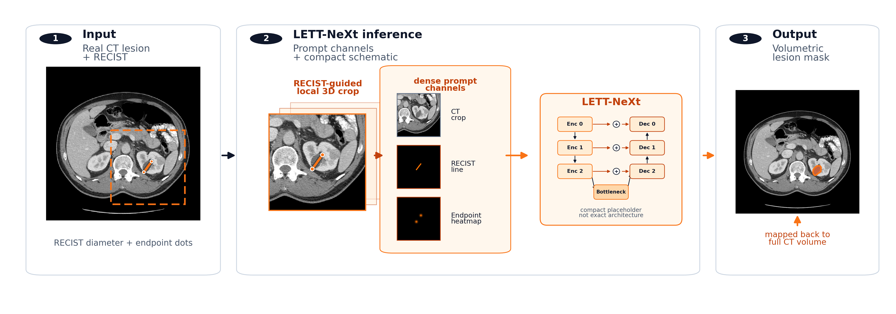
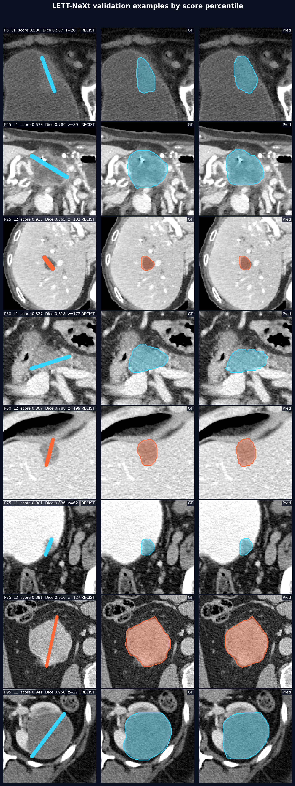
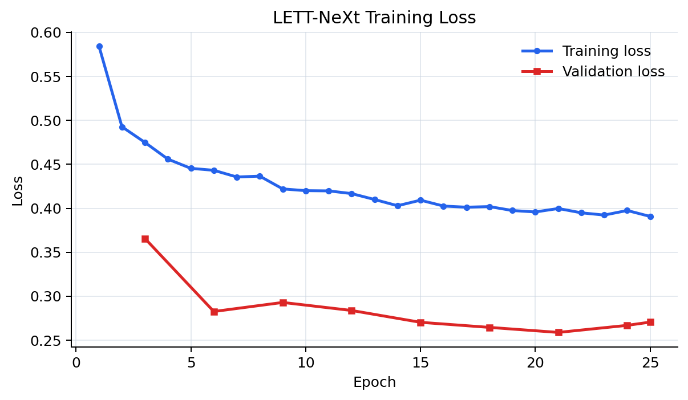
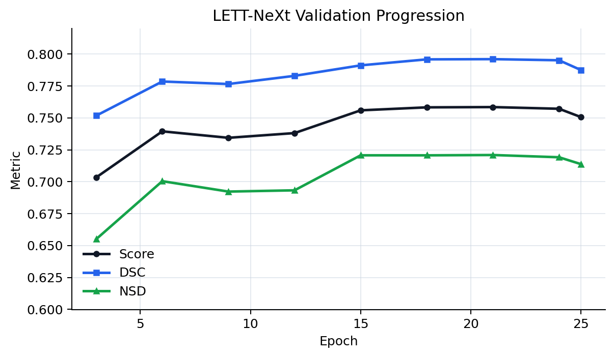

# LETT-NeXt

[](https://arxiv.org/abs/2606.30108)

Lightweight Efficient Tumor Tracing with NeXt.

Minimal LETT-NeXt reproducibility code for the FLARE25 RECIST-to-3D lesion segmentation submission.

**Competition:** [CVPR 2026 Foundation Models for Pan-cancer Segmentation in CT Images](https://www.codabench.org/competitions/7149/)



The package keeps one training recipe, one checkpoint, and one Docker submission path. It does not include raw FLARE or PanTS data.

The submitted inference-only checkpoint is committed at `artifacts/checkpoint.pt`. The Docker archive `artifacts/lett-next.tar.gz` is generated locally by `build_submission.py` and is not tracked.

## Validation Snapshot

Submitted CPU inference on the 49-case public validation mirror used threshold `0.35` and adaptive AutoZoom.

| Cases | Score | DSC | NSD | Failures |
| ---: | ---: | ---: | ---: | ---: |
| 49 | 75.87 +/- 12.17 | 79.43 +/- 10.09 | 72.32 +/- 16.22 | 0 |

Mean runtime was `6.88 +/- 3.00 s/case` under the 8 GB CPU submission setting, with maximum resident memory `3.57 GB`.



## Training Progress

The submitted checkpoint was selected by validation score during the fixed MedNeXt-v2 f32 training recipe.





## Layout

- `prepare.py`: prepares the fixed training/validation cache from the configured manifests.
- `train.py`: runs the fixed 3-GPU training recipe and runs submitted-path validation after training.
- `validate_checkpoint.py`: validates a checkpoint through the submitted CPU inference path.
- `evaluate_thresholds.py`: submitted-path threshold sweep.
- `predict.py`: runs local Python inference on `PanCancerSeg_Test/`.
- `build_submission.py`: builds `lett-next:latest` and writes `artifacts/lett-next.tar.gz`.
- `validate.py`: runs the Docker image and prints score/runtime/memory stats.
- `configs/lett_next.yaml`: the fixed training configuration.
- `artifacts/checkpoint.pt`: checkpoint used by the Docker submission.
- `eval/SurfaceDice.py`: vendored DSC/NSD metric implementation.

## Data

The raw/downloaded datasets are intentionally not committed. They are ignored by `.gitignore` and should be placed in the same relative layout used by `configs/lett_next.yaml`:

```text
data/train_npz/
data/validation_npz/validation_public_npz/
data/pants/ImageTr/
data/pants/LabelTr/
data/prepared/train_manifest.json
data/prepared/pants_aux_val_manifest.json
data/prepared/recist_manifest.json
```

The tracked manifests already point at those relative paths. `train_manifest.json` is the fixed training manifest, `recist_manifest.json` is the FLARE RECIST train/validation manifest, and `pants_aux_val_manifest.json` is the PanTS auxiliary validation manifest. Change `train_data_dir`, `val_data_dir`, or `pants_data_dir` in `configs/lett_next.yaml` only if the datasets are mounted somewhere else.

### FLARE RECIST-to-3D Data

The official competition access is through the [FLARE Pan-cancer Segmentation Codabench page](https://www.codabench.org/competitions/7149/). For this reproducibility package, the practical source is the gated Hugging Face mirror [FLARE-MedFM/FLARE-Task1-PancancerRECIST-to-3D](https://huggingface.co/datasets/FLARE-MedFM/FLARE-Task1-PancancerRECIST-to-3D), which exposes the exact `train_npz` and `validation_npz` layout used here.

Accept the dataset conditions on Hugging Face, then download from this directory:

```bash
uvx --from "huggingface_hub[cli]" hf auth login
uvx --from "huggingface_hub[cli]" hf download FLARE-MedFM/FLARE-Task1-PancancerRECIST-to-3D \
  --repo-type dataset \
  --local-dir data \
  --include "train_npz/**" \
  --include "validation_npz/**"
```

The validation scripts expect `data/validation_npz/validation_public_npz`. If the downloaded validation files are nested one level differently, keep the public validation NPZ files under that directory name.

### PanTS Data

LETT-NeXt uses PanTS only for auxiliary anatomy supervision during training. The expected local root is `data/pants`, containing `ImageTr` and `LabelTr`.

Download PanTS/PanTSMini with the official [MrGiovanni/PanTS](https://github.com/MrGiovanni/PanTS) scripts:

```bash
git clone https://github.com/MrGiovanni/PanTS.git /path/to/datasets/PanTS
cd /path/to/datasets/PanTS
bash download_PanTS_data.sh
bash download_PanTS_label.sh http://www.cs.jhu.edu/~zongwei/dataset/PanTSMini_Label.tar.gz
cd -
ln -s /path/to/datasets/PanTS/data data/pants
```

The PanTS Hugging Face page reports roughly 346 GB of files and the official script notes that image download needs about 300 GB of storage. Point the symlink at whichever durable storage location holds the downloaded `PanTS/data` directory:

```bash
ln -s /path/to/PanTS/data data/pants
```

### Data Check

After downloading, these checks should pass:

```bash
test -d data/train_npz
test -d data/validation_npz/validation_public_npz
test -d data/pants/ImageTr
test -d data/pants/LabelTr
uv run python prepare.py --config configs/lett_next.yaml
```

## Prepare

```bash
uv run python prepare.py --config configs/lett_next.yaml
```

`prepare.py` only caches manifest records whose raw files are present locally and prints a compact skipped-record summary. This keeps small smoke-test downloads usable without flooding the console with expected missing-file errors. Pass `--all-records` when you intentionally want to attempt the full manifest and inspect raw loading failures.

## Train

```bash
uv run python train.py --config configs/lett_next.yaml
```

Training uses the same local-file availability filter as `prepare.py`, so a small copied subset can be used for a GPU smoke test. A full paper reproduction still requires the full FLARE and PanTS data in the configured locations.

Training validates every `eval_every` epochs from the config with the fast RECIST-component evaluator and saves `best.pt` by that component score. After training finishes, it runs submitted-path full-case validation on `best.pt`; the run summary's `val_score`, `val_dsc`, and `val_nsd` are the submitted-path metrics.

The fixed launcher uses `train_nproc_per_node: 3` and `train_cuda_visible_devices: 0,1,2` from the config. An externally supplied `CUDA_VISIBLE_DEVICES` is preserved.

Training writes a self-contained run directory with `config.json`, `description.txt`, `train.log`, `metrics.json`, `target_audit.json`, `submission_validation/`, and `checkpoints/{best,last}.pt`. It no longer updates global `results.tsv` or `latest.json`.

Retraining is not expected to be byte-identical. The canonical submitted run scored about `0.760037` with the submitted-path validator; investigate scores below `0.74` as likely data, environment, or code drift.

## Fixed Crop Recipe

The training crop distribution is fixed in code because it is part of the submitted recipe, not a tunable experiment surface:

- 60% base RECIST prompt crops: crop around the RECIST line/endpoints.
- 30% multifov RECIST crops: crop a larger field of view around the RECIST prompt and resize it back to the model patch size, so the model sees more lesion context.
- Up to 10% bbox-tail rescue crops: only when the prompt crop may miss part of a large or awkward lesion, crop around the selected lesion bounding box so the target remains visible.

This mix keeps the usual RECIST-centered training signal while making the model robust to lesions that need more context or do not fit cleanly inside the base prompt crop.

## Checkpoint Validation

Use this when comparing a checkpoint to the submitted Docker behavior:

```bash
uv run python validate_checkpoint.py --checkpoint artifacts/checkpoint.pt
```

By default this reads `data/validation_npz/validation_public_npz`, writes predictions and logs to
`results/submission_validation`, and uses the same threshold and adaptive AutoZoom defaults as the Docker
submission.

## Threshold Sweep

```bash
uv run python evaluate_thresholds.py --checkpoint runs/<run-id>/checkpoints/best.pt
```

The threshold sweep uses the same submitted-path full-case validation as `validate_checkpoint.py` and writes `threshold_sweep.json` next to the checkpoint unless `--output` is supplied.

## Build Submission

```bash
uv run python build_submission.py
```

This writes:

```text
artifacts/lett-next.tar.gz
```

## Official-Style Run

The Docker image expects one or more input `.npz` files under `/workspace/inputs` and writes predictions to `/workspace/outputs`. To smoke-test the container with a few downloaded validation cases, create fresh local input/output folders and copy the first three validation files:

```bash
RUN_ID=$(date -u +%Y%m%dT%H%M%SZ)
INPUT_DIR=docker_inputs_${RUN_ID}
OUTPUT_DIR=lett_next_outputs_${RUN_ID}
mkdir -p "$INPUT_DIR" "$OUTPUT_DIR"
find data/validation_npz/validation_public_npz -maxdepth 1 -name '*.npz' | sort | head -3 | xargs -I{} cp {} "$INPUT_DIR"/
```

Then run the official-style prediction command:

```bash
docker load -i artifacts/lett-next.tar.gz
docker container run -m 8G --name lett-next --rm \
  -v "$PWD/$INPUT_DIR/":/workspace/inputs/ \
  -v "$PWD/$OUTPUT_DIR/":/workspace/outputs/ \
  lett-next:latest \
  /bin/bash -c "sh predict.sh"
```

`docker_inputs_*` folders are only for local smoke-test inputs. `lett_next_outputs_*` folders should start empty; the container creates prediction files there.

## Docker Runtime/Memory Validation

```bash
uv run python validate.py
```

This keeps Docker metadata for the run and prints case count, failures/timeouts, score fields when labels are present, time, RSS, and CPU memory-time stats.

## Submitted Inference Defaults

The Docker image uses adaptive AutoZoom by default:

```text
TASK2_THRESHOLD=0.35
TASK2_AUTOZOOM_ENABLE=1
TASK2_AUTOZOOM_MAX_PASSES=2
TASK2_AUTOZOOM_MIN_PASSES=1
TASK2_AUTOZOOM_GROWTH_ZYX=1.25,1.15,1.15
TASK2_AUTOZOOM_SCALE_MODE=adaptive
TASK2_AUTOZOOM_REFINE_DISABLE=1
```

The Docker wrapper still uses the legacy `TASK2_*` environment variable names expected by the submission scaffold.

Exact inference from `artifacts/checkpoint.pt` is reproducible. Retraining follows the same submitted recipe, but bit-identical weights are not guaranteed because GPU training can be nondeterministic.

## Citation

If you use LETT-NeXt, please cite:

```bibtex
@article{aas2026lettnext,
  title={LETT-NeXt: A Lightweight RECIST-Guided Model for 3D CT Lesion Segmentation},
  author={Aas, Sebastian and Stenhede, Elias and Ranjbar, Arian},
  journal={arXiv preprint arXiv:2606.30108},
  year={2026},
  url={https://arxiv.org/abs/2606.30108}
}
```
